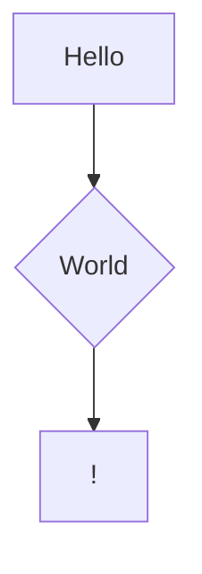

[link](https://example.com)

> [NOTE!]
> This is a sample README file.

> [IMPORTANT!]
> Please replace the content with your own information.

> [TIP!]
> You can use Markdown syntax to format your README file.

# HI

## H2

### H3

#### H4


Hello there


> Hi there

```python
print('Hello!')
```



